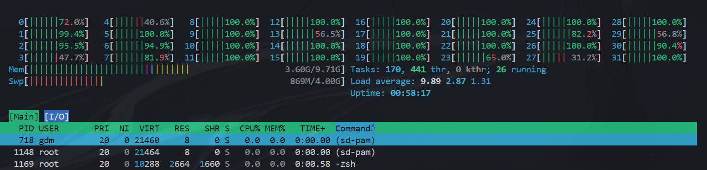
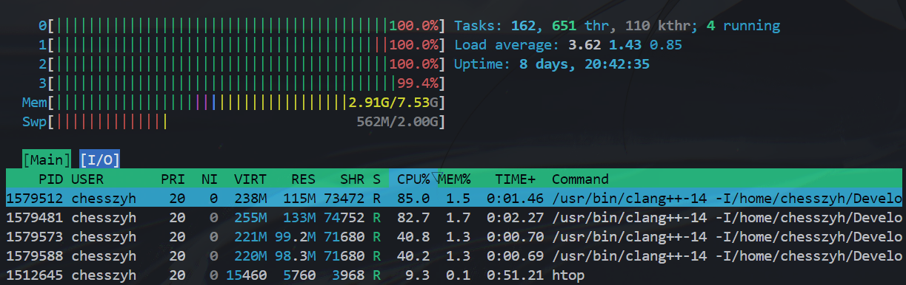

# Project0

<https://15445.courses.cs.cmu.edu/fall2024/project0/>

[Gemini](https://gemini.google.com/app/2c40f6aca09dccaf)

## Quick Start

### Clone

[bustub-public](https://github.com/cmu-db/bustub)
[bustub-private](https://github.com/Chesszyh/bustub-private)

官方仓库给的clone方法有些麻烦，是传统的`bare clone + mirror push`方法，在GitHub提供Fork功能并支持私有Fork之前，这是复制仓库的标准方法。现在我有Github CLI，其实只需要：

```bash
# 先登录
gh auth login
# WSL2不方便用浏览器，可以选择token验证

# Fork
gh repo fork cmu-db/bustub --clone --default-branch-only --fork-name bustub-private

cd bustub-private
git remote -v
# origin  https://github.com/Chesszyh/bustub-private.git (fetch)
# origin  https://github.com/Chesszyh/bustub-private.git (push)
# upstream        https://github.com/cmu-db/bustub.git (fetch)
# upstream        https://github.com/cmu-db/bustub.git (push)
# git push -u origin master # -u：设置默认上游分支
```

就可以了。但是命令行方法似乎仓库权限只能为public，我也没看到更多命令行选项？

```bash
USAGE
  gh repo fork [<repository>] [-- <gitflags>...] [flags]

FLAGS
  --clone                 Clone the fork
  --default-branch-only   Only include the default branch in the fork
  --fork-name string      Rename the forked repository
  --org string            Create the fork in an organization
  --remote                Add a git remote for the fork
  --remote-name string    Specify the name for the new remote (default "origin")
```

#### Issues

1. 不小心删除本地`.git`目录

```bash
# 方法1：备份，手动记录未提交更改，然后直接删除本地目录后重新克隆
# 其实是1更简单……

# 方法2：尝试补救，不删除本地文件
git init # 注意不要把.git文件夹里的文件分散地创建在项目根目录下……

# git remote set-url origin https://github.com/Chesszyh/bustub-private.git
git remote add origin git@github.com:Chesszyh/bustub-private.git

# 拉取远程仓库的所有分支和标签
git fetch origin

git checkout master # 可能需要-f
# 或者，如果你想强制覆盖本地文件以匹配远程仓库（会丢失本地未提交更改）：
# git reset --hard origin/main
git status
```

### Build

```bash
sudo bash build_support/packages.sh # 可能需要手动修改脚本
mkdir build
cd build

# 确保安装必要库，再开始编译！参考下文：#### Ubuntu 24.04 编译配置
# sudo apt update
# sudo apt install libdw-dev binutils-dev

# 指定编译器编译
cmake .. -D CMAKE_C_COMPILER=/usr/bin/clang-14 -D CMAKE_CXX_COMPILER=/usr/bin/clang++-14 # 或单纯 cmake ..
make -j$(nproc) # 使用与CPU核心数相等的线程数编译
```

注意，仓库明确指出不支持WSL，第一步安装包时就会报错`Unsupported distribution 'LINUX'`，需要手动调整脚本。我没有Mac，也不想弄个Ubuntu22.04的VM，但我有一个2核2G云服务器，所以我的想法是：WSL本地开发、测试，推送到github上之后利用`Git Hooks`在云服务器上自动编译和提交前测试。我希望开发环境差异不会给我带来太多困扰。

但是，云服务器编译实在是太慢了，`echo $(nproc)`输出2，尝试`make`一下，结果直接OOM，连SSH都挂了；而WSL可用的CPU核心数是32，编译速度差的实在是太多了。WSL2 `make -j$(nproc)`只需要半分钟就可以编译完成。如图：

#### Ubuntu 24.04 编译配置

在我本地4核8G的Ubuntu24.04上执行`cmake ..`时，有几个警告，主要是编译器版本不匹配和可选库`libdw`和`libbfd`缺失：

```bash
# 1. 编译器警告
# CMake Warning at CMakeLists.txt:53 (message):
#   !! We recommend that you use clang-14 for developing BusTub.  You're using
#   GNU 13.3.0, which is not clang.

# 须确保clang14已安装，再通过cmake参数指定编译器

# 2. 可选库缺失
# -- Could NOT find libdw (missing: LIBDW_LIBRARY LIBDW_INCLUDE_DIR)
# -- Could NOT find libbfd (missing: LIBBFD_LIBRARY LIBBFD_INCLUDE_DIR)
sudo apt update

#    libdw 的开发文件通常在 libdw-dev 或 elfutils-devel 包中
#    libbfd 的开发文件通常在 binutils-dev 包中
sudo apt install libdw-dev binutils-dev

# 清空build目录后重新编译
cmake .. -D CMAKE_C_COMPILER=/usr/bin/clang-14 -D CMAKE_CXX_COMPILER=/usr/bin/clang++-14
```

解决完所有问题后开始`make`编译，速度还挺快的(比云服务器快多了)，大概2-3分钟就编译完成：

`htop`：

#### Windows开发环境配置

如果非要用Windows，也最好仅做开发而非测试，即将完成的代码提交到Github后，本地服务器拉取代码、编译和测试。Windows开发时仍需要clang14进行语法支持等(集成vscode)。

首先`clang --version`检查，若没有，可到https://releases.llvm.org/download.html下载，安装时选择`LLVM 14`开头的即可。确保"Add LLVM to the system PATH"。

由于WSL的文件系统隔离性，Vscode打开Windows下文件夹作为工作区时，不一定能够找到需要的Linux开发工具。所以我们可以**通过remote-ssh连接到WSL，再打开挂载的Windows文件夹（或者WSL自身的文件夹）**进行开发。Python虚拟环境配置也是如此，不然`Ctrl+Shift+P`时找不到WSL虚拟环境下的解释器。

### Debug

应该可以用Code Runner直接调试，不需要进一步配置了。或者回归VS2022？

### Test

项目使用GTest作为单元测试框架，`DISABLED_`开头的测试用例会被跳过。

```bash
make -j$(nproc) hyperloglog_test
./test/hyperloglog_test
```

### Code Style

**Google C++ Style**: 

可使用clang-format、clang-tidy等工具来检查代码风格。

- 头文件：
    - `define`保护：`#ifndef/#define/#endif`
    - 使用前置声明（Forward Declarations）来减少编译依赖，减少头文件中的`#include`
- 作用域：
    - 鼓励使用`namespace`，但不要用`using namespace`，尤其是头文件
- 类：
    - 单参数构造函数通常应标记为 `explicit` 以防止意外的隐式转换。
    - `"Rule of Five"`：如果类定义了一个析构函数、拷贝构造函数、拷贝赋值运算符、移动构造函数或移动赋值运算符中的任何一个，则它应该显式地定义所有五个。
    - 谨慎使用继承：优先使用组合（Composition）或接口继承（Interface Inheritance）
- 函数：
    - 避免使用非 const 引用作为参数
- 命名要求：
    - 类型 (Type Names)、函数名: CamelCase (e.g., MyClass, UrlTable)
    - 各种变量、命名空间：小写字母下划线
    - 常量：k 后跟 CamelCase (e.g., kDaysInAWeek)
    - 枚举：类似常量或宏
    - 宏：大写字母下划线 (e.g., MAX_BUFFER_SIZE)
- 缩进：
    - **2个空格，不要用tab**
- C++特性：
    - 使用`const`, `constexpr`,`inline`
    - 整数：`<stdint.h>`固定宽度整数，增强移植性
    - 变量：鼓励`auto`，但如果类型不明显或重要，显式写出类型
    - **禁止使用 C++ 异常**(有争议)
    - 使用`std::unique_ptr`和`std::shared_ptr`来管理动态内存，避免使用裸指针（raw pointer）

## Project要求

### HyperLoglog

- 引入：大网站如何从千万条访问记录中统计出独立访客？传统排序、维护集合等算法时间/空间开销巨大。
- `HyperLoglog`：一种**近似算法**，使用概率统计方法来估计集合的基数，能以几乎恒定的内存消耗来处理任意大小的基数估计问题。它的核心思想是使用哈希函数将元素映射到一个二进制字符串中，然后通过计算字符串中前导零的数量来估计基数。
  - 只能估计基数，并且需要特殊处理极大极小值
  - HLL的效果严重依赖于哈希函数质量

#### [Meta](https://engineering.fb.com/2018/12/13/data-infrastructure/hyperloglog/)

#### 本项目实现要求

- task 1：MSB
- task 2：LSB